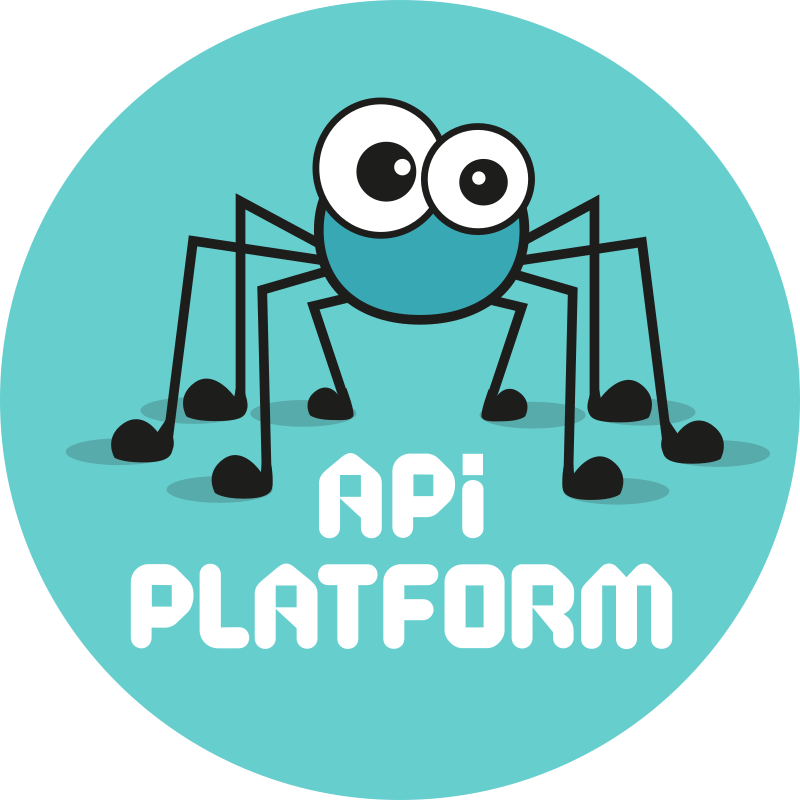

# ADMIN PANEL

    
    
    
    

## Description :

This project , is a little project where you can register and connect for access to admin Panel

## Fonctionnality :

- Register
- Login
- User gestion
- Analytics
